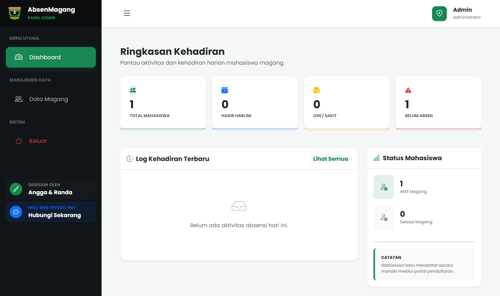
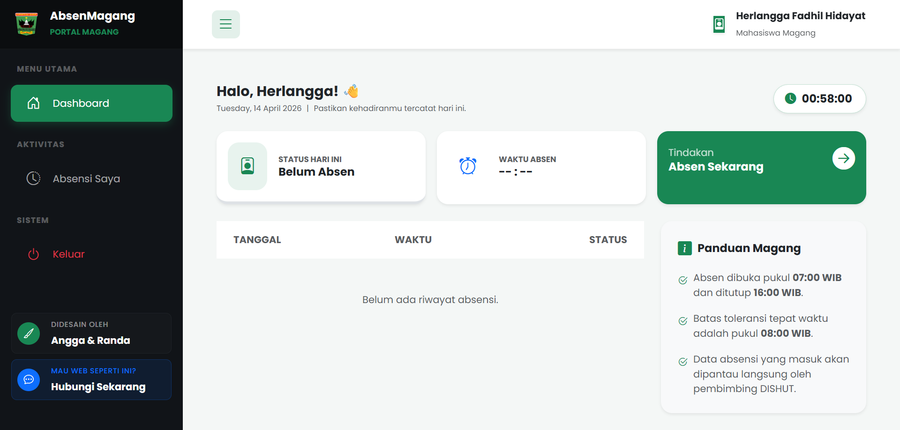

# 📝 AbsenMagang

  <b>Portal Absensi Mahasiswa Magang Berbasis Web</b> 
  <i>Dibangun dengan PHP OOP (MVC Architecture)</i>

  
  
  
  
  

---

## 📌 Tentang Project

AbsenMagang adalah sistem absensi berbasis web yang dirancang untuk mendigitalisasi proses kehadiran mahasiswa magang di lingkungan Dinas Kehutanan Provinsi Sumatera Barat.

Sistem ini dibangun menggunakan pendekatan modern:

- Object-Oriented Programming (OOP)
- MVC Architecture (Model - View - Controller)
- Responsive Design
- Clean UI / UX

Tujuan utama sistem:

- Meningkatkan efisiensi administrasi
- Mengurangi kesalahan pencatatan manual
- Mempermudah monitoring absensi secara real-time

---

## 🎯 Tujuan Sistem

- Digitalisasi sistem absensi manual
- Meningkatkan kedisiplinan mahasiswa
- Menyediakan data yang akurat & terstruktur
- Mempermudah pekerjaan admin
- Monitoring kehadiran secara real-time

---

## 🖼️ Preview Sistem

Contoh penggunaan:

  
    
  

---

## 🏗️ Arsitektur Sistem (OOP - MVC)

Controller:

- Mengatur alur aplikasi
- Menangani request & response

Model:

- Mengelola database
- Menjalankan query SQL

View:

- Menampilkan UI
- Berisi HTML, CSS, JavaScript

Alur sederhana:
User → Controller → Model → View → User

---

## 🚀 Fitur Utama

### 👤 Portal Mahasiswa

- 🔐 Registrasi & Login
- 📊 Dashboard Kehadiran
- ⚡ Quick Presence (Absen Sekarang)
- 📜 Riwayat Absensi
- 📘 Informasi jam operasional

Detail:
Mahasiswa dapat melakukan absensi dengan satu klik dan sistem akan otomatis memvalidasi waktu kehadiran.

---

### 🛡️ Panel Admin

- 📈 Statistik Real-time
- 👥 CRUD Data Mahasiswa
- 🕒 Monitoring Log Absensi
- 🏷️ Status Mahasiswa

Detail:
Admin dapat melihat seluruh aktivitas absensi dan mengelola data mahasiswa secara penuh.

---

## 🎨 UI / UX Design

Konsep desain:

- Modern Clean Design
- Dominasi warna hijau (#198754)
- Card-based layout
- Responsive design
- Navigasi sederhana

---

## 🛠️ Teknologi yang Digunakan

Backend:

- PHP (OOP)

Database:

- MySQL

Frontend:

- HTML5
- CSS3
- JavaScript

Styling:

- Bootstrap 5
- Custom CSS

---

## 📁 Struktur Folder

<pre>
absenmagang/
├── app/
│ ├── config/
│ ├── controllers/
│ │ ├── admin/
│ │ └── intern/
│ ├── core/
│ ├── models/
│ └── views/
│ ├── admin/
│ ├── auth/
│ ├── intern/
│ └── templates/
│
└── public/
├── css/
├── js/
└── img/
</pre>

---

## ⚙️ Instalasi

1. Clone Repository
   git clone https://github.com/username/absenmagang.git

2. Konfigurasi Database
   - Buat database: absen_magang
   - Import file SQL
   - Sesuaikan config.php

3. Jalankan Project
   - Pindahkan ke htdocs / www
   - Akses:
     http://localhost/absenmagang

---

## ⏰ Konfigurasi Waktu Absensi

- Absen Dibuka : 07:00 WIB
- Tepat Waktu : ≤ 08:00 WIB
- Absen Ditutup : 16:00 WIB

---

## 🔐 Keamanan Sistem

- Session Authentication
- Validasi input
- Role-based access
- Proteksi file penting

---

## 🚀 Pengembangan Selanjutnya

- QR Code Absensi
- GPS Tracking
- Export PDF / Excel
- Notifikasi WhatsApp

---

## 👨‍💻 Kontributor

- Randa (Backend Developer)
- Angga (Frontend & UI/UX)

---

## 🏢 Instansi

Dinas Kehutanan Provinsi Sumatera Barat

---

## ⭐ Dukungan

Jika project ini membantu:

- Berikan ⭐ pada repository
- Fork untuk pengembangan
- Gunakan sebagai referensi

---
